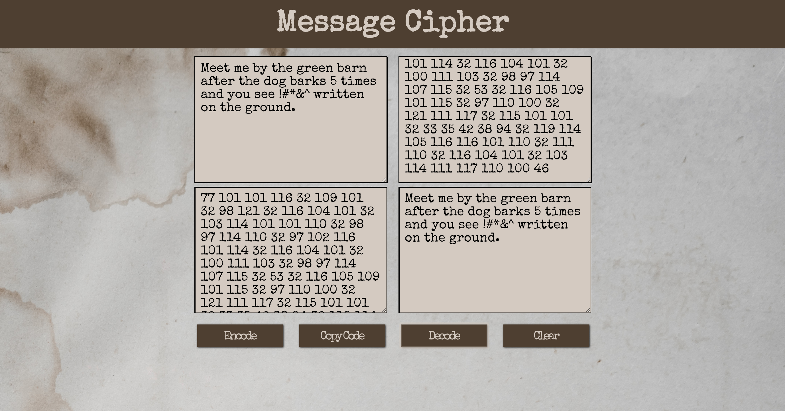
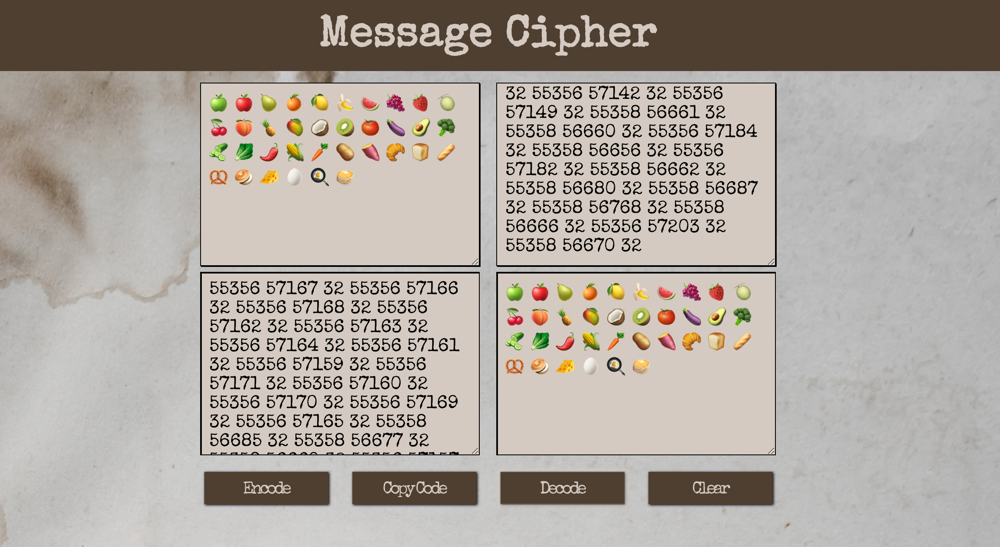
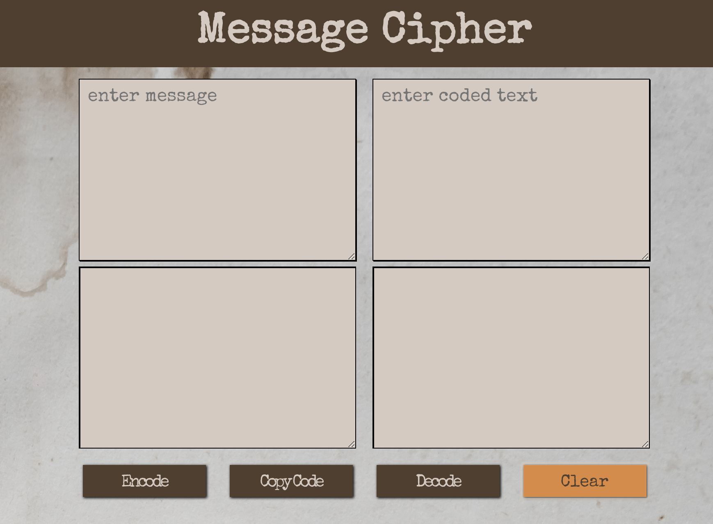

# Message Encoder / Decoder

**Title**:  Message Cipher

by Steve Hanlon

[Project sample](https://codepen.io/SixStringsCoder/pen/RvOEpb?editors=0110)

Project Goal: Make a JavaScript encoding and decoding single page app that takes text and converts it to Unicode and vice versa.

The unicode allows access to 150 scripts and 137,220 graphic characters.  So Chinese characters, Hebrew, Arabic and even emojis show up easily:

The Copycode button uses JavaScripts Document.execCommand() to allow for copying all the coded text to the clipboard.

The Clear button sets State to all empty strings allowing for all HTML text areas to be cleared out.

##### Start-up Server

To run the server, NPM or Yarn must be installed.

Open up the terminal and go to the project directory.  Inside of the project directory, run:

`npm install`

`npm start`

If you have Yarn installed run:

`yarn start`

This project was built using *Create React App*.  For complete technical details click [Create React App](./docs/README.md)

##### Technical Components
- React 16.5.2
- CSS 3.0 Flex Box
- HTML5
